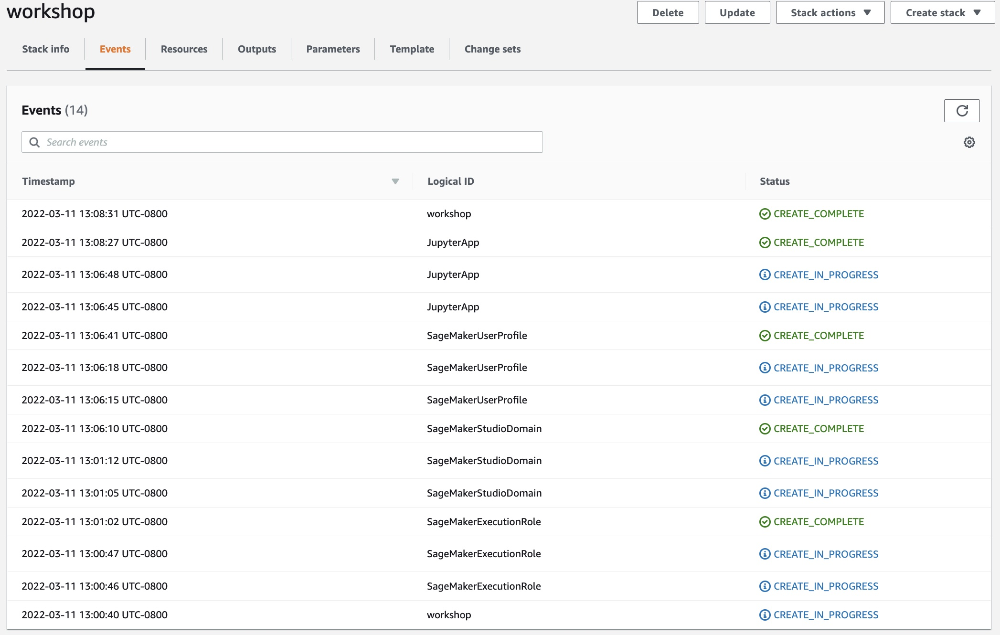

## Lab Environment Setup

## Day 1

The first step is to deploy a CloudFormation template that will perform much of the initial setup work for you. In another tab, login to your AWS account. Once you have done that, open the link below in a new tab (right click on the icon below) to start the process of deploying the items you need via CloudFormation.

Follow along with the screenshots below if you have any questions about deploying the stack.

Start by clicking `Next` at the bottom as shown:
  

  

Select the  `SageMakerSecurityGroupIds`, `SageMakerStudioSubnetIds`, and `VPCId` from the drop-down lists. Then, click `Next` at the bottom of the page.

 and 
 without changing anything until you get to the page shown below. Check the `I acknowledge that...` box and then 

  

  

Keep clicking `Next` until you reach the following page. Select `I acknowledge that AWS CloudFormation might create IAM resources with custom names` box and then click `Create stack` as shown below.

  

For a few minutes CloudFormation will be creating the resources described above on your behalf. 

Once it has completed you'll see green text like below indicating that the work has been completed. 

  

  
Right-Click and open [this link](https://us-east-1.console.aws.amazon.com/sagemaker/home?region=us-east-1#/studio) in a new tab to go to your SageMaker Studio console. In the list of `Users`, you should see  a user named as `defaultuser`. There is drop-down menu. Go ahead and select `Studio` from the list of `Launch app` as shown below:

  

  

You should see the SageMaker Studio page at this point:

  

  

At this step, you should clone the repository prepared for the lab today. https://github.com 

  

  

